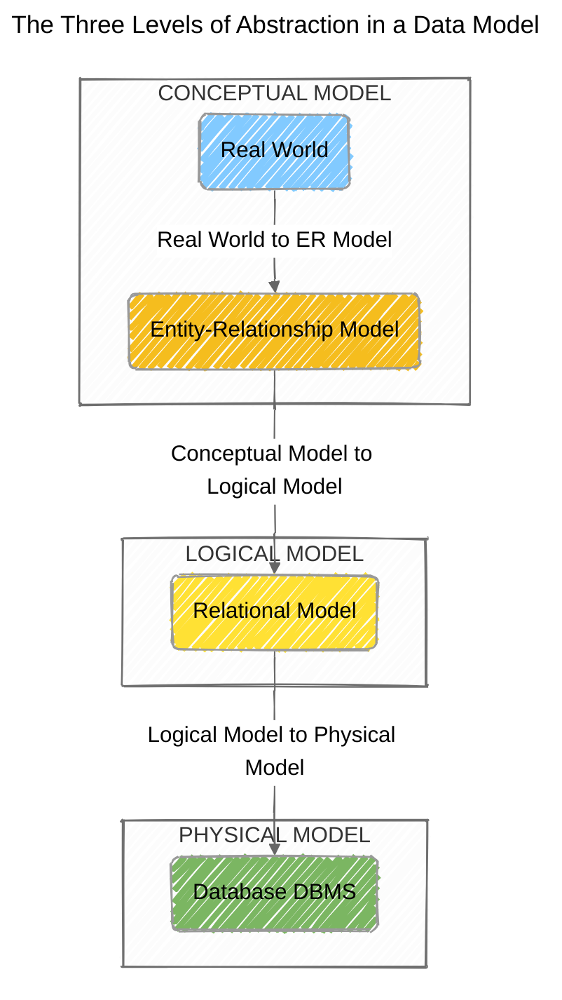
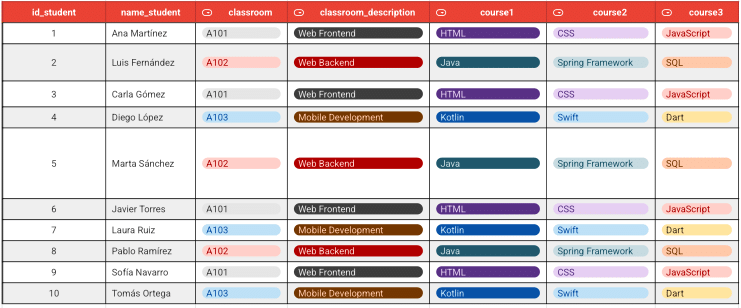
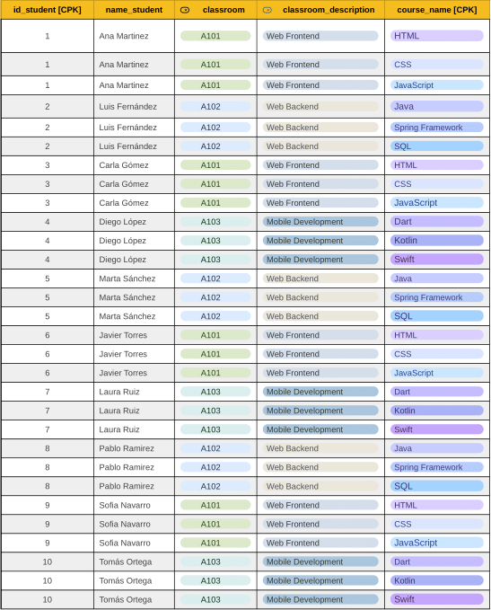
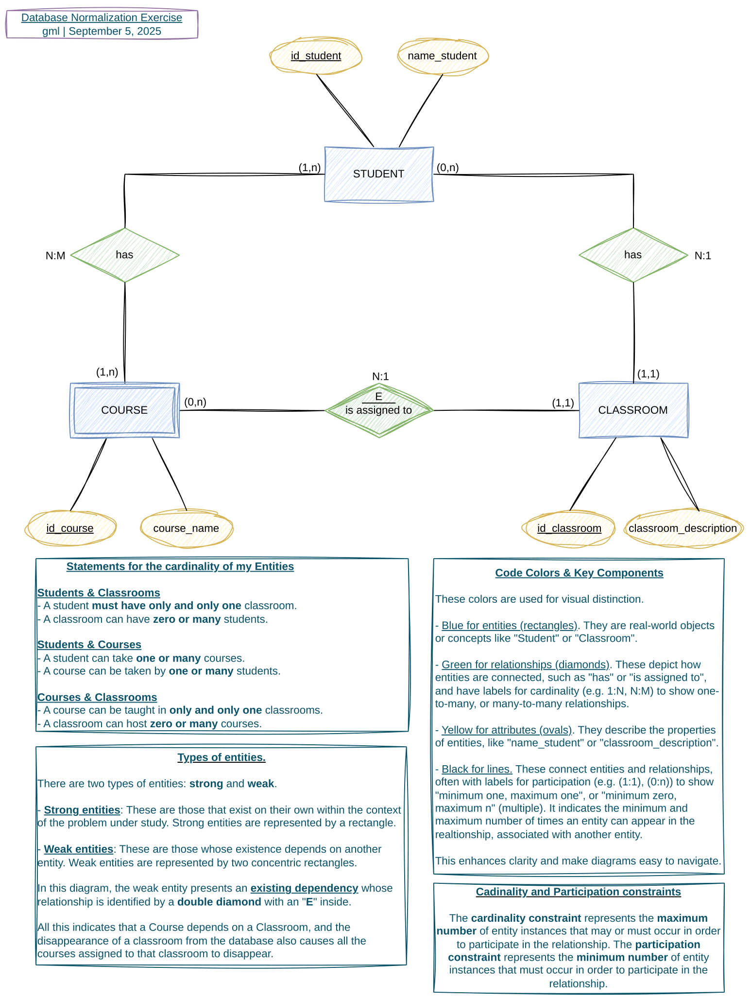
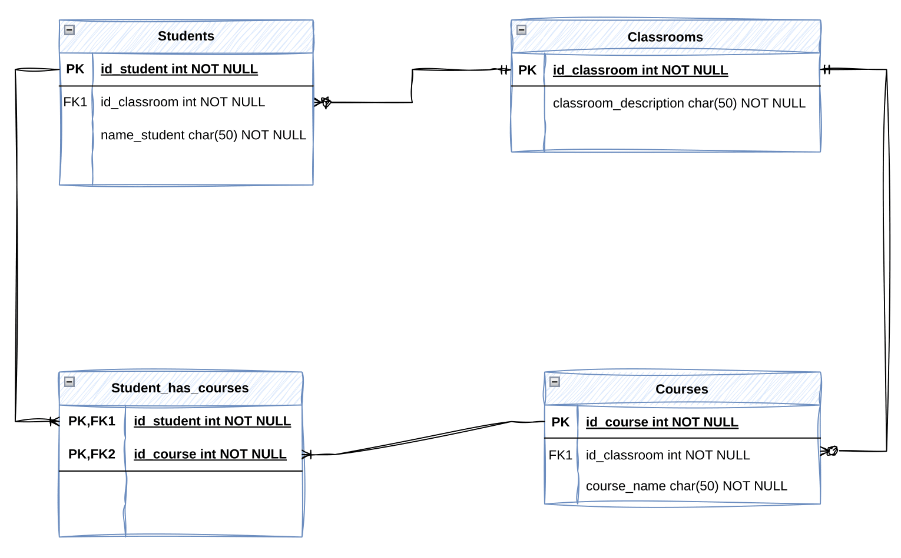

# 🚧 Database Normalization Exercise

This repository presents the comprehensive solution to
a [database normalization](https://en.wikipedia.org/wiki/Database_normalization)
challenge. The project begins with a single,
[unnormalized data table](https://docs.google.com/spreadsheets/d/16NefTsnqjgxS4qAOKDV9lxOuwATpzbfhEapZuQDwpTs/edit?usp=sharing)
and applies the principles
of [1NF](https://en.wikipedia.org/wiki/First_normal_form), [2NF](https://en.wikipedia.org/wiki/Second_normal_form),
and [3NF](https://en.wikipedia.org/wiki/Third_normal_form) to design an
optimized, relational
database schema. The final deliverables include a _conceptual_
[Chen Entity-Relationship (ER) Diagram](https://en.wikipedia.org/wiki/Entity%E2%80%93relationship_model)
and a
_logical_ [Crow's Feet database schema diagram](https://en.wikipedia.org/wiki/Entity%E2%80%93relationship_model#Crow's_foot_notation),
illustrating the database's structure and relationships.

## 🚀 Technologies Used

This exercises was developed using a combination of foundational tools and technologies.

* **Git & GitHub**: The version control system used to manage the project's history, track changes, and facilitate a structured
workflow through branching and commits.
* **Visual Studio Code and IntelliJ IDEA**: These are the integrated development environments (IDEs) used for development.
* **[Google Sheets](https://workspace.google.com/intl/en/products/sheets/)**: Used for the initial data manipulation and normalization process.
* **[draw.io](https://www.drawio.com/)**: The primary tool used to create the database diagrams for the conceptual and logical models.

## ✨ Features & Requirements

This exercise's goal was to meet the following key requirements, which served as the guiding principles for its development.

* **Database Normalization**: The core feature of this project was to normalize an unnormalized data table to a **Third Normal Form (3NF)**, compiant relational schema.
* **Conceptual Model**: The creation of a **Chen ER diagram** was required to represent the high-level, abstract relationships between entities.
* **Logical Model**: The creation of a **Crow's Feet diagram** was required to provide a detailed, logical blueprint of the database schema, including tables, keys, and relationships.
* **Repository and Documentation**: The exercise had to be managed on a GitHub repository with a complete README document that included a detailed description, diagrams, and a clear project
history through meaningful Git commits.

## 🔍 Strategic approach

My strategy for tackling this database normalization exercise is to follow systematic, step-by-step process. This
approach will ensure a clean & efficient final database design while also providing a clear demonstration of my
understanding of database theory.

The order of the sections in this document reflects the stages in which the database has been refined.

### Normal Forms

The core of this exercise is to apply the principles of database normalization to the provided unnormalized table. I
will follow a progressive approach to ensure the data is structured correctly & efficiently.

1. **[First Normal Form (1NF)](https://en.wikipedia.org/wiki/First_normal_form)**: To achieve 1NF, I will ensure that
   each field is:

   - **Atomic** (indivisible).
   - There are **no repeating groups of columns** in the table. This means I'll separate repeating data into individual
     rows & columns to eliminate duplicate information.
   - The table must also have a **Primary Key** (PK).
   - No attributes (fields) should contain **null values**.

2. **[Second Normal Form (2NF)](https://en.wikipedia.org/wiki/Second_normal_form)**: Once in 1NF, I will move to 2NF.
   This requires me to **identify & remove any partial dependencies**. A partial dependency occurs when a _non-key
   attribute_ is dependent on only a part of the _composite primary key_. I will separate these fields into independent
   tables to ensure all attributes depend on the entire Primary Key.

3. **[Third Normal Form (3NF)](https://en.wikipedia.org/wiki/Third_normal_form)**: The final step of this exercise is to
   achieve 3NF. This builds on 2NF by **eliminating transitive dependencies**. A transitive dependency exists when a
   non-key attribute is dependent on another non-key attribute. To resolve this, I will move these fields to new,
   separate tables, ensuring that every field in a table depends directly on the Primary Key, and nothing but the key.

### Data Modeling

I will continue by considering the problem in terms of the three levels of data modeling, as illustrated below.

1. **Conceptual Model**: This is the first step, where I will identify the main entities and the high-level
   relationships between them from the tables obtained during the previous normalization process. The goal is to understand the "Real World"
   problem without focusing on technical details. I will represent this model using a **Chen Entity-Relationship (ER)
   Diagram**.

2. **Logical Model**: After conceptualizing the data with the payload previously obtained from the normalization process, 
   I will continue building a structured logical model. I will use all the tables, their attributes (fields), and the relationships between them,
   including [Primary Keys (PK)](https://en.wikipedia.org/wiki/Primary_key) and [Foreign Keys (FK)](https://en.wikipedia.org/wiki/Foreign_key).
   This model is a direct blueprint for the database and will be represented by a **Crow's Feet diagram**.

3. **Physical Model**: Although not required for this exercise, this would be the final stage of the process, where the
   logical model is implemented in a
   specific [database management system (DBMS)](https://en.wikipedia.org/wiki/Database#Database_management_system), with
   considerations for data types, indexes, and performance.

## ♻️ Normalization Process

### 1. First Normal Form (1NF)

In this first stage of the normalization process, I aim to create a table
with all fields **atomic**, **without repeating groups** or **null values**,
and with a **defined primary key**.

I began this process with
an [unnormalized table](https://docs.google.com/spreadsheets/d/16NefTsnqjgxS4qAOKDV9lxOuwATpzbfhEapZuQDwpTs/edit?gid=1393331381#gid=1393331381),
that is, a set of unordered data.

It took me two iterations to complete this task. During
the [first iteration](https://docs.google.com/spreadsheets/d/16NefTsnqjgxS4qAOKDV9lxOuwATpzbfhEapZuQDwpTs/edit?gid=202487438#gid=202487438),
I managed to correctly identify all the fields, translate all the attributes from Spanish to English, and sort the
records, checking for null values.

Finally, during
the [second iteration](https://docs.google.com/spreadsheets/d/16NefTsnqjgxS4qAOKDV9lxOuwATpzbfhEapZuQDwpTs/edit?gid=202487438#gid=202487438),
I transformed the unnormalized data to meet 1NF requirements. To do this, I separated the repeated `course` columns
into individual rows and created
a **composite primary key** with `id_student` and `course_name`.

### 2. Second Normal Form (2NF)

Once my table was in the 1NF state, the goal at this point was to **eliminate partial dependencies**,
ensuring that all **non-key attributes** were fully dependent on the **entire primary key**.

To achieve this goal, I identified the fields that weren't entirely dependent on the **composite
primary key** (i.e., `name_student`, `classroom`, and `classroom_description`).

| Composite Primary Key      | Non-Key Attributes      | Does it depend on the entire CPK?                                    |
| -------------------------- | ----------------------- | -------------------------------------------------------------------- |
| `id_student` `course_name` | `name_student`          | No, it only depends on their `id_student`                            |
|                            | `classroom`             | No, it only depends on their `id_student`                            |
|                            | `classroom_description` | No, it depends on `classroom`, which in turn depends on `id_student` |

I then separated these fields into new, separate tables (i.e., `Students` and `Classrooms`).

Finally, to resolve the [many-to-many relationship](<https://en.wikipedia.org/wiki/Many-to-many_(data_model)>) between
students and courses,
I created the `Student-Courses` table (also called a join table
or [associative entity](https://en.wikipedia.org/wiki/Associative_entity#:~:text=An%20associative%20entity%20is%20a,%2C%20informally%2C%20an%20associative%20table.)).
This table acted as a bridge between the `Students` and `Courses` tables. It was composed of two foreign keys.

Together, these two foreign keys form a composite primary key (just like in 1NF) for the `Student_Courses` table.
This unique combination ensures that each row represents a single enrollment instance: **a specific student taking a
specific course**.

In essence, this table breaks down
the [many-to-many relationship](<https://en.wikipedia.org/wiki/Many-to-many_(data_model)>)
into two [one-to-many relationships](<https://en.wikipedia.org/wiki/One-to-many_(data_model)>):

- A student can have **many** entries in the `Student_Courses` table.
- A course can have **many** entries in the `Student_Courses` table.

This is the standard and most efficient way to model this type of relationship in a relational database.
It ensures [data integrity](https://www.ibm.com/think/topics/data-integrity) and
avoids [redundancy](https://www.ibm.com/think/topics/data-redundancy).

At the time, I had three separate tables, each in 2NF because all non-key attributes were completely dependent on their
respective primary keys.

### 3. Third Normal Form (3NF)

One of the milestones of this exercise was to refine the tables to their 3NF state. To achieve this, once my tables were in 2NF form, I needed to **eliminate transitive dependencies**, ensuring that no non-key attribute depended on another.

In this particular case, the normalization process to 2NF has already resolved the transitive dependencies.

During this step, I created a separate `COURSES` table to hold the `course_name`, a unique identifier for the courses and `id_classroom` a field (foreign key) that refers to the primary key of the `CLASSROOM` table.

To conclude the first phase of this exercise, I present below the final result of the table normalization process.

Thanks to this database design process, I was able to organize the data efficiently and reduce redundancy. The main objectives were:

- **Eliminate redundant data**: By dividing a large table into smaller, related tables, I avoided storing the same data multiple times. This is important because it will save space and make the future database more efficient.

- **Ensure data integrity**: Normalization helped me ensure data consistency and accuracy. By storing data only once, I will avoid anomalies in updates, inserts, and deletes. For example, if a student's course were stored in multiple locations, an update to that course could be performed in only one of them, resulting in inconsistencies.

- **Improve flexibility**: A well-normalized database will be easier to modify and extend, since schema changes can be made in one place without affecting other parts of the database.

At this point, I had the **logical blueprint** for my database and was ready to move on to the next key deliverable: **the Conceptual Model**. Chen's Entity-Relationship (ER) diagram would serve as a high-level overview of the work done, representing the entities and their relationships in a clear, abstract format.

## ✍ Data Modeling

I was ready to consider how the data should be organized and related to create a **high-level blueprint** using the conceptual model and finally a **detailed blueprint** using the logical model.

### 💡 Conceptual Model

This was the time for the next key deliverable: the Conceptual Model, which is used in the initial stages of database design.

In this case, I used **Chen's Entity-Relationship (ER) Diagram** as a high-level, visual overview of the work done, primarily representing entities and their relationships in a clear, abstract format.

The main types of ERDs (Entity-Relationship Diagrams) are **Conceptual**, **Logical**, and **Physical**, which represent increasing levels of detail, from an abstract, high-level overview to the specific technical details of a database implementation.

I used the normalized tables from the previous steps to broadly identify entities (`STUDENTS`, `CLASSROOMS`, `COURSES`), their relationships, and attributes, without including technical details about attributes or storage.

The purpose of [this conceptual ERD](https://drive.google.com/file/d/1GjajGZ9PVo8j4_fJf5nUH4ptAbWDl_ZZ/view?usp=sharing) was to provide a high-level, abstract overview of the system's main entities and their relationships.

Its target audience is business stakeholders and analysts who want to understand the basic structure and requirements of the system.

### 🗄️ Logical Model

Once the normalization process is complete and the conceptual model is established, the next and final step in this exercise is to create a logical model that presents a different level of detail in data modeling. A more detailed, yet still abstract,
view of the database structure, regardless of the specific technology.

This model serves as a detailed model for the  final database, translating the general concepts of Chen's ER diagram into a structured schema that can be implemented in a [database management system (DBMS)](https://en.wikipedia.org/wiki/Database#Database_management_system).

The Crow's Feet notation provides a clear visual representation of tables, their columns (including a primary and foreign keys), and the precise cardinality of their relationships.

[This logical diagram](https://drive.google.com/file/d/109eTVfU7PFW509tdmr5zvcTPN4XpfIA7/view?usp=sharing) bridges the conceptual model with the physical implementation, ensuring that all data is considered and relationships are clearly defined.

Its target audience is database designers, who use it to model data and its relationships at the conceptual level for a specific database system.

We have reached the end of my exercise, congratulations and thank you if you have been able to stick with me all this time, you are amazing!

And remember...

>" _It is essential to understand the database structure before writing a single line of code, ensuring that the design is robust, efficient, and accurately reflects the standardized data model._ "

## 🧠 Key Learning & Concepts

This exercise was a comprehensive journey into database design, from theory to practical application. The key concepts I learned and applied are:

* **The Importance of Normalization [logical blueprint]**: I learned that normalizing a database is essential to prevent data redundancy, insertion anomalies, update anomalies, and deletion anomalies. By following the steps of 1NF, 2NF, and 3NF, I was able to transform a single, unorganized table 
into a clean and efficient relational schema.

* **The Three Levels of Data Modeling**: I gained a practical understanding of how database design progresses through different levels of abstraction.
  1. **Conceptual Model (Chen ERD) [high-level  blueprint]**: This high-level view helped me identify the main entities and their relationships without getting bogged down in the technical details.
  2. **Logical Model (Crow's Feet Diagram) [detailed blueprint]**: This model provided a detailed blueprint of the database, including tables, columns, and relationships, that  bridges the conceptual design with the physical implementation.
  3. **Physical Model**: While not a deliverable for this exercise, understanding this final stage helped me appreciate how the logical  design is executed in a real-world database management system.

* **Primary, Foreign, and Composite Keys**: I learned how to identify unique identifiers and establish relationships between tables using keys. The use of a **composite primary key** in the `Student_Courses` join table was a key learning point for resolving many-to-many relationships.

* **Git and GitHub Workflow**: Beyond database concepts, this project reinforced the importance of a structured version control workflow. Using a `develop` branch and separate feature branches for each major task (e.g., `feat/1NF-tables`, `feat/logical-model`) allowed me to manage changes
cleanly and maintain a clear, profesional project history.
 
* **README-Driven Development**: I discovered the value of using the README as a living document to guide the project, By documenting my approach, methodology, and progress, the README became more than just a summary, it became a reflection of my thought process and showcase of my skills.

## ℹ️ About

This project is part of the [Full Stack Web Development training program](https://factoriaf5.org/aprende/desarrollo-web-full-stack-asturias/) in [Asturias](https://en.wikipedia.org/wiki/Asturias), offered by [Factoría F5](https://factoriaf5.org/).

The curriculum covers a wide range of topics, from basic programming languages ​​and UX principles to advanced project development techniques. It includes front-end and back-end technologies, agile methodologies, and tools for user experience design and database development. The program also focuses on essential soft skills such as communication, problem-solving, teamwork, adaptability, and time management.

## 📧 Contact

For any questions or inquiries, please do not hesitate to contact me!

Happy coding! 🌱 🐒