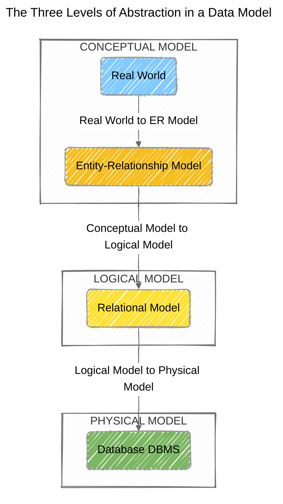

# 🚧 Database Normalization Exercise

This repository presents the comprehensive solution to
a [database normalization](https://en.wikipedia.org/wiki/Database_normalization)
challenge. The project begins with a single,
[unnormalized data table](https://docs.google.com/spreadsheets/d/16NefTsnqjgxS4qAOKDV9lxOuwATpzbfhEapZuQDwpTs/edit?usp=sharing)
and applies the principles
of [1NF](https://en.wikipedia.org/wiki/First_normal_form), [2NF](https://en.wikipedia.org/wiki/Second_normal_form),
and [3NF](https://en.wikipedia.org/wiki/Third_normal_form) to design an
optimized, relational
database schema. The final deliverables include a _conceptual_
[Chen Entity-Relationship (ER) Diagram](https://en.wikipedia.org/wiki/Entity%E2%80%93relationship_model)
and a
_logical_ [Crow's Feet database schema diagram](https://en.wikipedia.org/wiki/Entity%E2%80%93relationship_model#Crow's_foot_notation),
illustrating the database's structure and relationships.

## 🔍 Strategic approach

My strategy for tackling this database normalization exercise is to follow systematic, step-by-step process. This
approach will ensure a clean & efficient final database design while also providing a clear demonstration of my
understanding of database theory.

The order of the sections in this document reflects the stages in which the database has been refined.

### Normal Forms

The core of this exercise is to apply the principles of database normalization to the provided unnormalized table. I
will follow a progressive approach to ensure the data is structured correctly & efficiently.

1. **[First Normal Form (1NF)](https://en.wikipedia.org/wiki/First_normal_form)**: To achieve 1NF, I will ensure that
   each field is:

   - **Atomic** (indivisible).
   - There are **no repeating groups of columns** in the table. This means I'll separate repeating data into individual
     rows & columns to eliminate duplicate information.
   - The table must also have a **Primary Key** (PK).
   - No attributes (fields) should contain **null values**.

2. **[Second Normal Form (2NF)](https://en.wikipedia.org/wiki/Second_normal_form)**: Once in 1NF, I will move to 2NF.
   This requires me to **identify & remove any partial dependencies**. A partial dependency occurs when a _non-key
   attribute_ is dependent on only a part of the _composite primary key_. I will separate these fields into independent
   tables to ensure all attributes depend on the entire Primary Key.

3. **[Third Normal Form (3NF)](https://en.wikipedia.org/wiki/Third_normal_form)**: The final step of this exercise is to
   achieve 3NF. This builds on 2NF by **eliminating transitive dependencies**. A transitive dependency exists when a
   non-key attribute is dependent on another non-key attribute. To resolve this, I will move these fields to new,
   separate tables, ensuring that every field in a table depends directly on the Primary Key, and nothing but the key.

### Data Modeling

I will by considering the problem in terms of the three levels of data modeling, as illustrated below.

1. **Conceptual Model**: This is the first step, where I will identify the main entities and the high-level
   relationships between them from the provided unnormalized data table. The goal is to understand the "Real World"
   problem without focusing on technical details. I will represent this model using a **Chen Entity-Relationship (ER)
   Diagram**.

2. **Logical Model**: After conceptualizing the data, I will apply the rules of normalization to create a structured
   logical model. This involves defining all the tables, their attributes (fields), and the relationships between them,
   including [Primary Keys (PK)](https://en.wikipedia.org/wiki/Primary_key) & [Foreign Keys (FK)](https://en.wikipedia.org/wiki/Foreign_key).
   This model is a direct blueprint for the database and will be represented by a **Crow's Feet diagram**.

3. **Physical Model**: Although not required for this exercise, this would be the final stage of the process, where the
   logical model is implemented in a
   specific [DataBase Management System (DBMS)](https://en.wikipedia.org/wiki/Database#Database_management_system), with
   considerations for data types, indexes, and performance.

## ♻️ Normalization Process & Data Modeling

### 1. First Normal Form (1NF)

In this first stage of the normalization process, I aim to create a table
with all fields **atomic**, **without repeating groups** or **null values**,
and with a **defined primary key**.

I began this process with
an [unnormalized table](https://docs.google.com/spreadsheets/d/16NefTsnqjgxS4qAOKDV9lxOuwATpzbfhEapZuQDwpTs/edit?gid=1393331381#gid=1393331381),
that is, a set of unordered data.

It took me two iterations to complete this task. During
the [first iteration](https://docs.google.com/spreadsheets/d/16NefTsnqjgxS4qAOKDV9lxOuwATpzbfhEapZuQDwpTs/edit?gid=202487438#gid=202487438),
I managed to correctly identify all the fields, translate all the attributes from Spanish to English, and sort the
records, checking for null values.

Finally, during
the [second iteration](https://docs.google.com/spreadsheets/d/16NefTsnqjgxS4qAOKDV9lxOuwATpzbfhEapZuQDwpTs/edit?gid=202487438#gid=202487438),
I transformed the unnormalized data to meet 1NF requirements. To do this, I separated the repeated `course` columns
into individual rows and created
a **composite primary key** with `id_student` and `course_name`.

### 2. Second Normal Form (2NF)

Once my table was in the 1NF state, the goal at this point was to **eliminate partial dependencies**,
ensuring that all **non-key attributes** were fully dependent on the **entire primary key**.

To achieve this goal, I identified the fields that weren't entirely dependent on the **composite
primary key** (i.e., `name_student`, `classroom`, and `classroom_description`).

| Composite Primary Key      | Non-Key Attributes      | Does it depend on the entire CPK?                                    |
| -------------------------- | ----------------------- | -------------------------------------------------------------------- |
| `id_student` `course_name` | `name_student`          | No, it only depends on their `id_student`                            |
|                            | `classroom`             | No, it only depends on their `id_student`                            |
|                            | `classroom_description` | No, it depends on `classroom`, which in turn depends on `id_student` |

I then separated these fields into new, separate tables (i.e., `Students` and `Classrooms`).

Finally, to resolve the [many-to-many relationship](<https://en.wikipedia.org/wiki/Many-to-many_(data_model)>) between
students and courses,
I created the `Student-Courses` table (also called a join table
or [associative entity](https://en.wikipedia.org/wiki/Associative_entity#:~:text=An%20associative%20entity%20is%20a,%2C%20informally%2C%20an%20associative%20table.)).
This table acted as a bridge between the `Students` and `Courses` tables. It was composed of two foreign keys.

Together, these two foreign keys form a composite primary key (just like in 1NF) for the `Student_Courses` table.
This unique combination ensures that each row represents a single enrollment instance: **a specific student taking a
specific course**.

In essence, this table breaks down
the [many-to-many relationship](<https://en.wikipedia.org/wiki/Many-to-many_(data_model)>)
into two [one-to-many relationships](<https://en.wikipedia.org/wiki/One-to-many_(data_model)>):

- A student can have **many** entries in the `Student_Courses` table.
- A course can have **many** entries in the `Student_Courses` table.

This is the standard and most efficient way to model this type of relationship in a relational database.
It ensures [data integrity](https://www.ibm.com/think/topics/data-integrity) and
avoids [redundancy](https://www.ibm.com/think/topics/data-redundancy).

At the time, I had three separate tables, each in 2NF because all non-key attributes were completely dependent on their
respective primary keys.

### 3. Third Normal Form (3NF)

One of the milestones of this exercise was to refine the tables to their 3NF state. To achieve this, once my tables were in 2NF form, I needed to **eliminate transitive dependencies**, ensuring that no non-key attribute depended on another.

In this particular case, the normalization process to 2NF has already resolved the transitive dependencies.

During this step, I created a separate `COURSES` table to hold the `course_name` and a unique identifier for the courses.

To conclude the first phase of this exercise, I present below the final result of the table normalization process.

Thanks to this database design process, I was able to organize the data efficiently and reduce redundancy. The main objectives were:

- **Eliminate redundant data**: By dividing a large table into smaller, related tables, I avoided storing the same data multiple times. This is important because it will save space and make the future database more efficient.

- **Ensure data integrity**: Noramlization helped me ensure data consistency and accuracy. By storing data only once, I will avoid anomalies in updates, inserts, and deletes. For example, if a student's course were stored in multiple locations, an update to that course could be performed in only one of them, resulting in inconsistencies.

- **Improve flexibility**: A well-normalized database will be easier to modify and extend, since schema changes can be made in one place without affecting other parts of the database.

At this point, I had the **logical blueprint** for my database and was ready to move on to the next key deliverable: **the Conceptual Model**. Chen's Entity-Relationship (ER) diagram would serve as a high-level overview of the work done, representing the entities and their relationships in a clear, abstract format.
