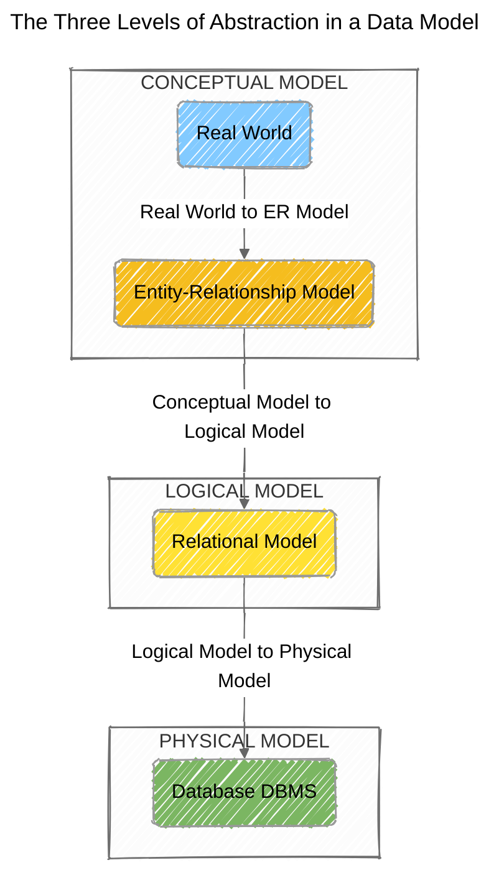

# 🚧 Database Normalization Exercise

This repository presents the comprehensive solution to
a [database normalization](https://en.wikipedia.org/wiki/Database_normalization)
challenge. The project begins with a single,
[unnormalized data table](https://docs.google.com/spreadsheets/d/16NefTsnqjgxS4qAOKDV9lxOuwATpzbfhEapZuQDwpTs/edit?usp=sharing)
and applies the principles
of [1NF](https://en.wikipedia.org/wiki/First_normal_form), [2NF](https://en.wikipedia.org/wiki/Second_normal_form),
and [3NF](https://en.wikipedia.org/wiki/Third_normal_form) to design an
optimized, relational
database schema. The final deliverables include a _conceptual_
[Chen Entity-Relationship (ER) Diagram](https://en.wikipedia.org/wiki/Entity%E2%80%93relationship_model)
and a
_logical_ [Crow's Feet database schema diagram](https://en.wikipedia.org/wiki/Entity%E2%80%93relationship_model#Crow's_foot_notation),
illustrating the database's structure and relationships.

## 🔍 Strategic approach

My strategy for tackling this database normalization exercise is to follow systematic, step-by-step process. This approach will ensure a clean & efficient final database design while also providing a clear demonstration of my understanding of database theory.

### Data Modeling

I will by considering the problem in terms of the three levels of data modeling, as illustrated below.

1. **Conceptual Model**: This is the first step, where I will identify the main entities and the high-level relationships between them from the provided unnormalized data table. The goal is to understand the "Real World" problem without focusing on technical details. I will represent this model using a **Chen Entity-Relationship (ER) Diagram**.

2. **Logical Model**: After conceptualizing the data, I will aplly the rules of normalization to create a structured logical model. This involves defining all the tables, their attributes (fields), and the relationships between them, including [Primary Keys (PK)](https://en.wikipedia.org/wiki/Primary_key) & [Foreign Keys (FK)](https://en.wikipedia.org/wiki/Foreign_key). This model is a direct blueprint for the database and will be represented by a **Crow's Feet diagram**.

3. **Physical Model**: Althoug not required for this exercise, this would be the final stage of the process, where the logical model is implemented in a specific [DataBase Management System (DBMS)](https://en.wikipedia.org/wiki/Database#Database_management_system), with considerations for data types, indexes, and performance.

### Normal Forms

The core of this exercise is to apply the principles of database normalization to the provided unnormalized table. I will follow a progressive approach to ensure the data is structured correctly & efficiently.

1. **[First Normal Form (1NF)](https://en.wikipedia.org/wiki/First_normal_form)**: To achieve 1NF, I will ensure that each field is:
    * Atomic (indivisible).
    * There are no repeating groups of columns in the table. This means I'll separate repeating data into individual rows & columns to eliminate duplicate information.
    * The table must also have a Primary Key (PK).
    * No attributes (fields) should contain null values.

2. **[Second Normal Form (2NF)](https://en.wikipedia.org/wiki/Second_normal_form)**: Once in 1NF, I will move to 2NF. This requires me to **identify & remove any partial dependencies**. A partial dependency occurs when a _non-key attribute_ is dependent on only a part of the _composite primary key_. I will separate these fields into independent tables to ensure all attributes depend on the entire Primary Key.

3. **[Third Normal Form (3NF)](https://en.wikipedia.org/wiki/Third_normal_form)**: The final step of this exercise is to achieve 3NF. This builds on 2NF by **eliminating transitive dependencies**. A transitive dependency exists when a non-key attribute is dependent on another non-key attribute. To resolve this, I will move these fields to new, separate tables, ensuring  that every field in a table depends directly on the Primary Key, and nothing but the key.
